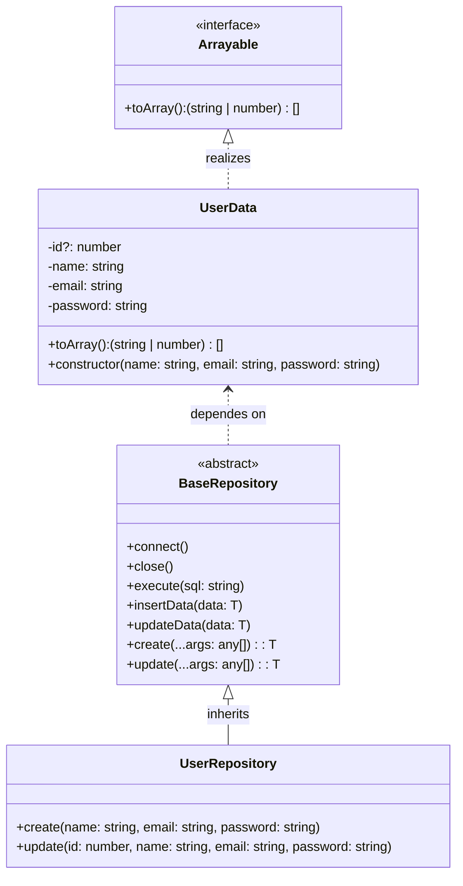

# クラス設計.md

# 

```mermaid
classDiagram
    class BaseRepository {
        <<abstract>>
        +connect()
        +close()
        +execute(sql: string)
        +insertData(data: T)
        +updateData(data: T)
        +create(...args: any[]): T
        +update(...args: any[]): T
    }
    class UserRepository {
        +create(name: string, email: string, password: string)
        +update(id: number, name: string, email: string, password: string)
    }
    class UserData {
        -id?: number
        -name: string
        -email: string
        -password: string
        +toArray(): (string | number)[]
        +constructor(name: string, email: string, password: string)
    }
    class Arrayable {
        <<interface>>
        +toArray(): (string | number)[]
    }
    BaseRepository <|-- UserRepository :inherits
    UserData <.. BaseRepository :dependes on
    Arrayable <|.. UserData :realizes
```
